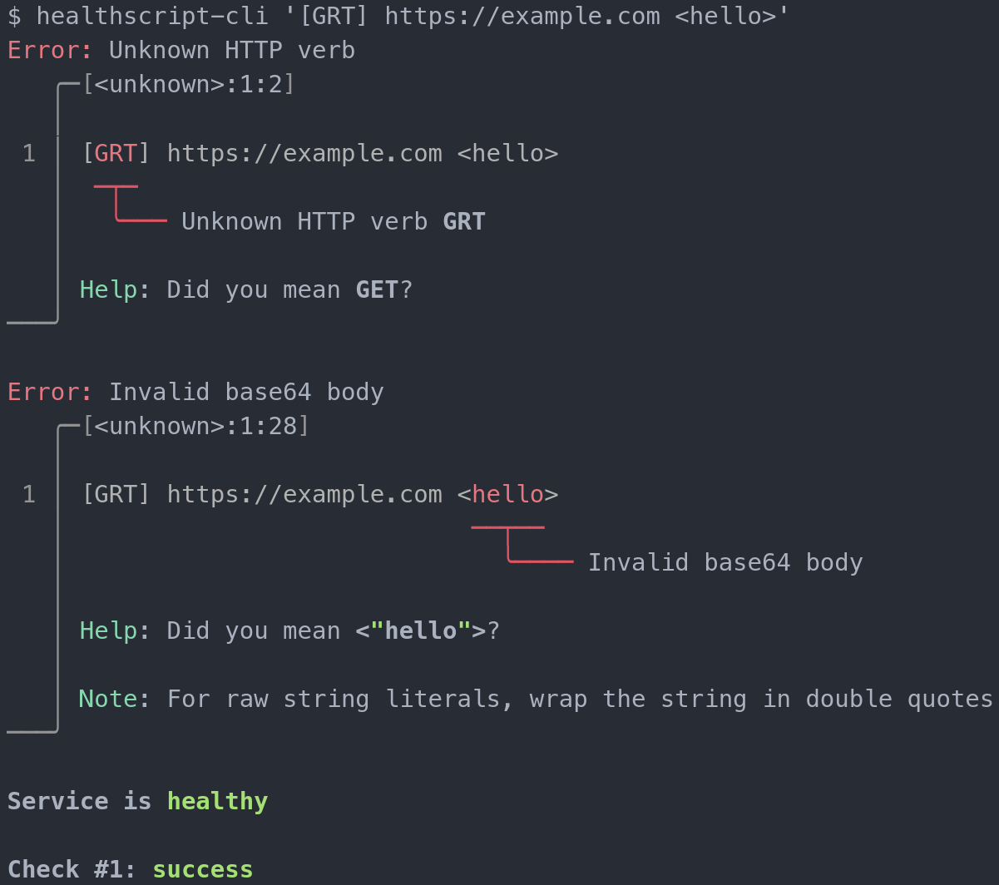

# Healthscript

A [DSL](https://en.wikipedia.org/wiki/Domain-specific_language) for writing healthchecks.

Read the [blog post](https://mbund.dev/posts/healthscript) for uses cases and why this was created.


The best way to grok the language is to look at the [examples below](#http-examples).

The general philosophy behind the language design are as follows:

  - Tags before the uri are included as part of the request, and tags after the uri are expectations about the response
  - "Meta" tags like HTTP verbs, HTTP headers, status codes, and timeouts are in square brackets `[]`
  - Body tags are in angle brackets `<>`
  - Urls with custom schemes should be used to denote the protocol in the url, similar to `postgres://` urls for example

## HTTP Examples

- Make an HTTP `GET` request to `https://example.com`, and expect a `200` status code

  - `https://example.com`
  - 

- Make an HTTP `POST` request to `https://httpbin.org/post` with a `User-Agent: curl/7.72.0` header, and expect a `200` status code and a response header of `server: gunicorn/19.9.0`

  - `[POST] [User-Agent: curl/7.72.0] https://httpbin.org/post [server: gunicorn/19.9.0]`
  - 

- Make an HTTP `POST` request with some JSON, and expect a `200` status code and the response body to be JSON matching the [jq](https://stedolan.github.io/jq) expression `.json.a == 3`

  - `[POST] <{ "a": 3 }> https://httpbin.org/post <(.json.a == 3)>`
  - >)

- Make an HTTP `POST` request with body bytes encoded in base64 to `https://httpbin.org/post`, and expect a `200` status code

  - `[POST] <aHR0cHM6Ly9naXRodWIuY29tL3Job21idXNnZy9oZWFsdGhzY3JpcHQ=> https://httpbin.org/post`
  - 

## Error Recovery

The parser will recover from errors as best as possible to help you write correct healthscript. Errors are available using the CLI.



Install the CLI with

```
cargo install healthscript-cli
```

## Badge Service

Append healthscript at the end of `https://healthscript.mbund.dev/` to have the hosted server run the healthcheck against your service and generate an svg badge. Then, you can use markdown syntax to include it in your own readmes.

```

```


You may need to url encode your spaces to `%20`.

## Library

Integrate healthscript into your own rust project. To do so, add the following to your `Cargo.toml`

```
healthscript = "1.0"
```

Or use the `cargo` CLI.

```
cargo add healthscript
```

## TCP Examples

- Connect to `pwn.osucyber.club` on port `13389` over TCP, and expect at least one byte to be returned

  - `tcp://pwn.osucyber.club:13389`
  - 

- Connect to `pwn.osucyber.club` on port `13389` over TCP, and expect the response to contain the regex `/e./` to be found anywhere within the response, timing out after 3 seconds

  - `tcp://pwn.osucyber.club:13389 </e./> [3s]`
  - 

- Connect to `pwn.osucyber.club` on port `13389` over TCP, and expect the response to start with the string `chee`

  - `tcp://pwn.osucyber.club:13389 <"chee">`
  - 

## Ping Examples

- Ping `example.com`, and expect a response, timing out after 8 seconds

  - `ping://example.com`
  - 

## DNS Examples

- Make a DNS query to `example.com` and expect any response

  - `dns://example.com`
  - 

- Make a DNS query to `example.com` using the dns server `1.1.1.1` and expect any response

  - `dns://example.com/1.1.1.1`
  - 
