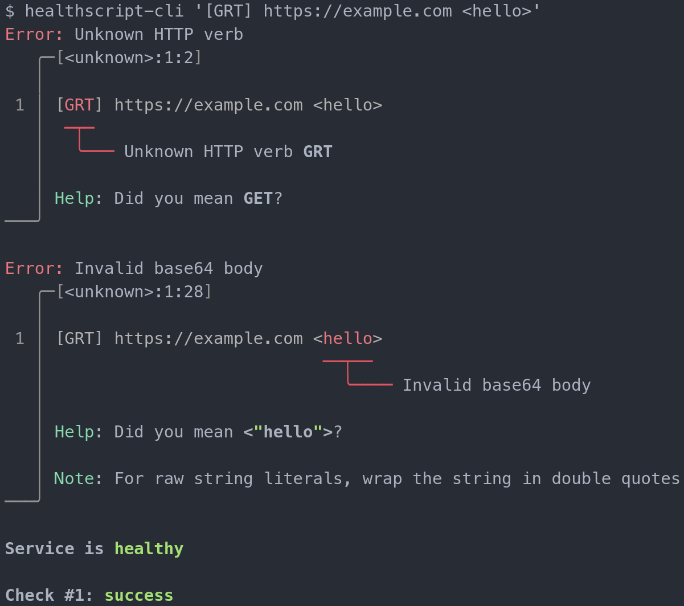

# Healthscript CLI



[Healthscript](https://crates.io/crates/healthscript) is a simple DSL for checking the health of a service using HTTP, TCP, ICMP (ping), and more.

Install the CLI to run healthchecks locally, and iterate with error messages.

```
cargo install healthscript-cli
```

```
$ healthscript-cli --help
CLI for healthscript, a simple DSL for checking the health of a service using HTTP, TCP, ICMP (ping), and more.

Usage: healthscript-cli <SCRIPT>

Arguments:
  <SCRIPT>  Healthscript to execute

Options:
  -h, --help     Print help
  -V, --version  Print version
```

## Badges

Another way to use healthscript, without installing anything to your computer, is to generate badges for markdown. [See it in the main healthscript repo](https://crates.io/crates/healthscript#badge-service)


